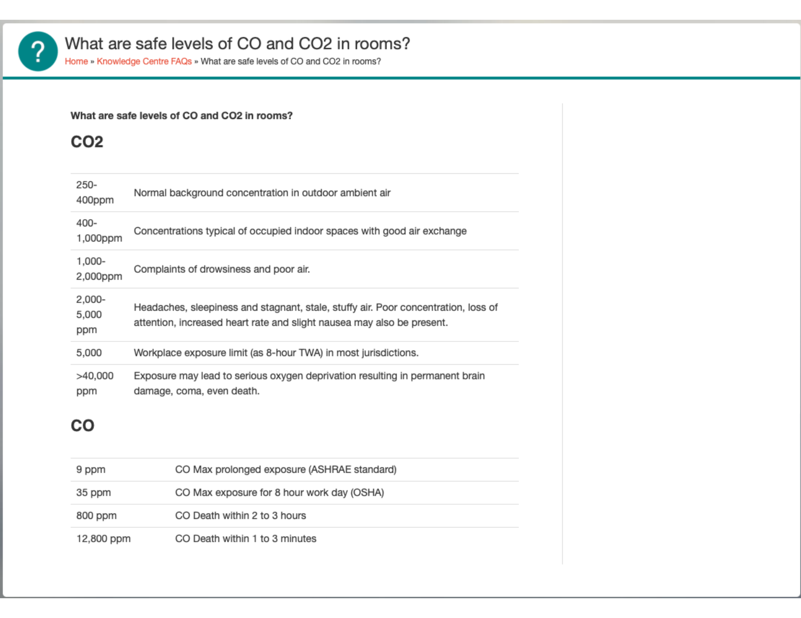

# RCO2

## Purpose
Realtime CO2, aka rco2, samples and displays temperature, humidity, and CO2 (carbon dioxide) levels.

RCO2 was created to be a small, portable way to determine if the CO2 level in a room I was in (e.g. conference space, meeting room, restaraunt, etc.) was "good".
## Associated projects
RCO2 has a number of sibling projects that share many common hardware and code attributes. Those are:
- [Air Quality](https://github.com/ericklein/air_quality) samples temperature, humidity, and if connected to the appropriate sensor, CO2 (carbon dioxide) levels. If AQ is configured with a screen, it can display this information. If AQ is connected to WiFi, it can log this information to a number of network endpoints, and it displays local outdoor weather and air quality information to compliment the indoor sensor information.
- [Powered Air Quality](https://github.com/ericklein/powered_air_quality) has all of the features of AQ along with the ability to sample local air particulate levels. This project uses an AC power source.
- [Badge](https://github.com/ericklein/badge) is RCO2 in a badge form factor capable of displaying additional information beyond air quality levels.
## Features
AI : ADD DOCUMENTATION
## Target configuration
- Set parameter configuration using config.h
- Private configuration settings including WiFi SSID/password and network endpoint credentials are contained in a `secrets.h` file that is not included in this repo.  Instead you'll find the file `secrets_template.h`, which should be copied to `secrets.h` and then edited to supply the right access credentials and configuration values to match your deployment environment.
## Bill of Materials (BOM)
### MCU
- [Adafruit ESP32-S3 Reverse Feather](https://www.adafruit.com/product/5691)
    - core code is fairly portable
### Sensor
- [SCD40 CO2, Temperature and Humidity Sensor](https://www.adafruit.com/product/5187)
    - any SCD40 wired to i2c
### Battery
#### monitor
- [Adafruit ESP32-S3 Reverse Feather](https://www.adafruit.com/product/5691)
    - MAX17048 support
#### battery
- standard LiPo battery with JST 2-PH cable
### Screen
- [Adafruit ESP32-S3 Reverse Feather](https://www.adafruit.com/product/5691)
    - Any screen supporting ST7789 driver
### Buttons/Switches
- [Adafruit ESP32-S3 Reverse Feather](https://www.adafruit.com/product/5691)
    - toggle button
- SPDT switch
    - on/off
- Stemma QT cable between SCD40 and MCU board
## Pinouts
- SPDT switch (on/off)
    - MCU EN to SPD rightmost pin
    - MCU GND to SPD
- SCD40
    - Stemma QT cable between MCU board and SCD40 board
        - or connect 3.3v/5v, GND, SDA, SCL on both sides
## Issues and Feature Requests
- [Github Issues](https://github.com/ericklein/rco2/issues)
## .plan (big ticket items)
- [WiFI Manager](https://github.com/tzapu/WiFiManager) support
- OTA firmware update support
## Supporting Material
### Screen
- https://cdn-learn.adafruit.com/downloads/pdf/adafruit-gfx-graphics-library.pdf
### Temperature and Humdity
- [Ideal indoor humidity](https://iaq.works/humidity/indoor-humidity-level-why-is-the-40-60-range-ideal/)
### CO2 (Carbon Dioxide)
#### Scales
We currently use the following scale:
- <800 - Good
- 800-999 - So-So
- 1000+ - Poor
##### Alternate ideas
- 
- 
- 
#### Impact on health
- [CO2 and indoor air quality](readme/CO2_and_indoor_air_quality.pdf)
#### Sensors
- [CO2 sensor types](https://www.airgradient.com/blog/co2-sensors-photo-acoustic-vs-ndir-updated/)
- SCD40 sensor
    - [SCD40 datasheet](readme/Sensirion_CO2_Sensors_SCD4x_Datasheet.pdf)
### AQI
- [AQI Overview](readme/aqi_overview.md)
- [Open Weather Map Air Pollution API](https://openweathermap.org/api/air-pollution)
- [OSHA Air Quality](readme/OSHA_Indoor_Air_Quality.pdf)
- [Great site for air quality info](https://itsairborne.com/)
- [NYT on indoor gas stoves](https://www.nytimes.com/2023/01/29/climate/gas-stove-health.html)